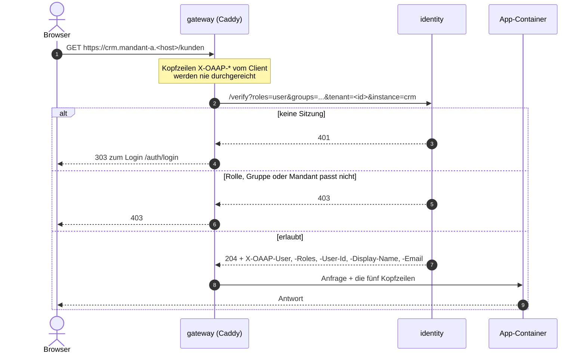
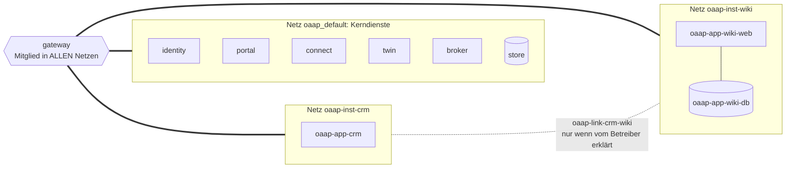
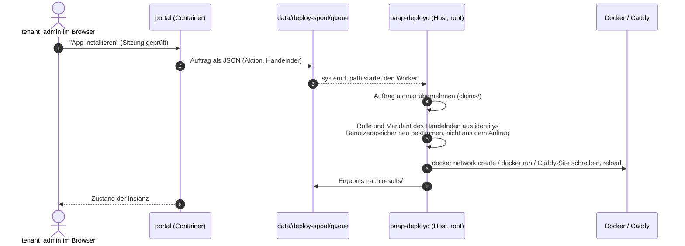
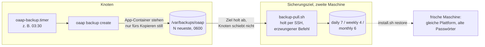

# Ein OAAP-Knoten von innen — Kurzdokumentation für Betreiber

> Geprüft gegen Referenz **0.1.147** (2026-09-30), am Code von
> `oaap-reference` gelesen. Zielgruppe: Hoster, Betreiber und
> Sicherheitsprüfer, die eine OAAP-VM verstehen oder begutachten wollen.
> Beispiele verwenden Platzhalter (`<host>` = die registrierte
> Internet-Adresse, z. B. `oaap.beispiel.de`; `<mandant>`, `<instanz>`).

Diese Seite beschreibt **einen Knoten**, also eine VM oder einen Rechner
mit einer OAAP-Installation, wie er als Multi-Mandanten-System
betrieben wird: Ports, Netze, Datenfluss, Dateisystem, Geheimnisse,
Backup und Updates. Sie ist die Landkarte. Die Regeln selbst stehen in den
Spezifikationen (`oaap-spec`), auf die jeder Abschnitt verweist. Am Ende
steht, was **bewusst noch nicht** gebaut ist. Das gehört zur Beschreibung
und ist dort kein Kleingedrucktes.

---

## 1. Der Knoten auf einen Blick

```mermaid
flowchart LR
    internet(["Internet / LAN"])

    subgraph host["Host: Debian + Docker Engine"]
        direction LR
        subgraph core["Plattformnetz oaap_default"]
            gw["gateway<br/>Caddy<br/>:80 :443 :8100-8199"]
            idp["identity<br/>Login, Sitzungen,<br/>API-Schlüssel, /verify"]
            portal["portal<br/>Launchpad, Verwaltung"]
            connect["connect<br/>Tunnel, Fernzugang"]
            store[("store<br/>Postgres<br/>Profil store")]
            twin["twin<br/>Profil store"]
            broker["broker<br/>MQTT<br/>Profil broker"]
            relay["relay<br/>Profil broker"]
        end
        subgraph a1["Netz oaap-inst-crm"]
            app1["App-Container<br/>crm"]
        end
        subgraph a2["Netz oaap-inst-wiki"]
            app2["App-Container<br/>wiki"]
            app2db[("App-eigene DB")]
        end
        worker["oaap-deployd<br/>systemd, root<br/>appctl.py"]
        fs[("/var/lib/oaap")]
    end

    internet -->|"80, 443, 8100-8199"| gw
    gw --> idp
    gw --> portal
    gw --> connect
    gw --> twin
    gw --> broker
    gw -. "tritt jedem App-Netz bei" .-> app1
    gw -.-> app2
    app2 --- app2db
    twin --> store
    relay --> store
    relay --> broker
    portal -->|"Auftrag als Datei<br/>deploy-spool/queue"| worker
    worker -->|"docker run / network / exec"| a1
    worker --> fs
```



Der Knoten hat **genau eine Tür**, das Gateway (Caddy). Dahinter liegen
drei Arten von Bausteinen:

| Baustein | Was er tut | Läuft als |
| -------- | ---------- | --------- |
| **Kerndienste** (`gateway`, `identity`, `portal`, `connect`) | Eingang, Anmeldung, Verwaltung, Tunnel | Docker-Compose-Projekt `oaap` |
| **Optionale Plattformdienste** (`store`/`twin`, `broker`/`relay`) | gemeinsame Mandantendaten (Postgres), Ereignisse (MQTT) | nur mit Knotenprofil `store` bzw. `broker` |
| **App-Instanzen** | die eigentlichen Anwendungen der Mandanten | ein oder mehrere Container je Instanz, **eigenes Netz je Instanz** |
| **Host-Worker** `oaap-deployd` | führt alle Zustandsänderungen aus: Container starten, Netze, Caddy-Konfiguration | systemd-Dienst, **root**, `app/appctl.py` |

Weiter: [RFC-0002 Security-First](https://github.com/MDJoerg/oaap-spec/blob/main/rfcs/RFC-0002-security-first-access-model.md),
[oaap.core.gateway](https://github.com/MDJoerg/oaap-spec/blob/main/spec/oaap.core.gateway.md),
[oaap.core.host](https://github.com/MDJoerg/oaap-spec/blob/main/spec/oaap.core.host.md).

---

## 2. Ports

| Port | Protokoll | Wer lauscht | Wofür | Immer offen? |
| ---- | --------- | ----------- | ----- | ------------ |
| `80` (`OAAP_HTTP_PORT`) | TCP/HTTP | gateway | Portal und Login im LAN; auf registrierten Namen Umleitung auf HTTPS; ACME-Challenge | ja |
| `443` | TCP/HTTPS | gateway | alle registrierten Internet-Namen (`oaap external set`), Zertifikate automatisch per ACME | **ja**, auch vor `external set` gebunden |
| `8100–8199` | TCP/HTTP | gateway | ein **LAN-Port je App-Instanz** (unverschlüsselt, mit Anmeldung) | ja, alle 100 |
| `8200–8299` | TCP/UDP | **App-Container direkt** | vom Betreiber einzeln freigegebene Nicht-HTTP-Endpunkte (RFC-0015), am Gateway vorbei | nur mit Profil `exposed` und Freigabe |
| `1883` | TCP/MQTT | broker | Geräte ohne HTTP; Anmeldung auf MQTT-Ebene gegen identity | nur mit Profilen `broker` **und** `exposed` |
| `51820+` | UDP/WireGuard | Netz-Namensraum je Instanz | befristeter Fernzugang in **ein** Instanznetz (RFC-0044) | nur mit Profil `remote-access`, solange ein Zugang offen ist |
| `22` | SSH | Host | Administration | nicht von OAAP verwaltet |

**Nicht veröffentlicht** sind Postgres (`store:5432`), der MQTT-WebSocket
(`9001`), der Tunnel-Dienst `connect` und zwei interne Gateway-Listener
(`8098` Destinations, `8099` Gesundheitsprobe). Sie sind nur über das
Docker-Netz erreichbar.

> **Wichtig für eine VM mit öffentlicher Adresse:** OAAP richtet **keine
> Host-Firewall** ein, und Docker veröffentlicht Ports an `ufw` vorbei.
> Die LAN-Ports `:80` und `:8100–8199` sprechen **Klartext-HTTP mit
> Login**. Seit 0.1.161 schließt `sudo oaap node add-profile gateway-only`
> die Reihe `8100–8199` nach außen (Bindung an Loopback); `80`/`443`
> bleiben, eine Firewall ersetzt das nicht. Auf einer Internet-VM gehört davor eine Firewall des Hosters
> oder Regeln in der `DOCKER-USER`-Kette, die aus dem Internet nur `443`,
> `80` (ACME, Umleitung) und SSH durchlassen. Siehe §12.

---

## 3. Der Weg einer Anfrage

Jede HTTP-Anfrage, auch WebSocket, läuft durch das Gateway. Das Gateway
fragt für jede nicht öffentliche Route **identity** (`forward_auth`) und
reicht der App bei Erfolg fünf vertrauenswürdige Kopfzeilen weiter.



Die Prüfreihenfolge in identity: Sitzung oder API-Schlüssel → **Rolle** →
**Sichtbarkeitsgruppe** (RFC-0007) → **Mandant** (RFC-0022). Ein
unbekannter Mandant wird abgelehnt (fail-closed). `server_admin`
überspringt Gruppe und Mandant, und das ist Absicht (siehe §5).

**Öffentliche Routen**, die eine App im Manifest als `public` erklärt,
brauchen keine Anmeldung. Sie werden stattdessen gedrosselt
(Voreinstellung 300 Anfragen je 60 s je Instanz, Route und Client,
RFC-0010), und die Identitäts-Kopfzeilen werden entfernt. Die Plattform hat
selbst nur wenige öffentliche Routen: `/auth/*`, `/setup*` (nur bis zum
ersten Admin), `/platform/*` (Stylesheet, Logos), `/deploy/*`
(Deploy-Token), `/fleet/*` (Flottenschlüssel), `/connect/*` (Tunnel-,
Fernzugangs-Schlüssel).

**Adressen auf einem Multi-Mandanten-Knoten** (nach `oaap external set <host>`):

| Adresse | Führt zu |
| ------- | -------- |
| `https://<host>` | Portal des Standard-Mandanten |
| `https://<mandant>.<host>` | der **Ort** eines Mandanten: sein Portal, sein Titel, Logo und Farben (RFC-0042) |
| `https://<instanz>.<mandant>.<host>` | eine App-Instanz des Mandanten |
| eigene Namen je Instanz | z. B. `crm.kunde.de`, per DNS auf den Knoten (RFC-0009/0018) |
| `https://*.t.<host>` | befristete Freigaben aus inneren Netzen (RFC-0033) |

Mandanten-Kürzel stehen damit in Zertifikaten und sind über die
Certificate-Transparency-Logs **öffentlich**. Deshalb sind sie
standardmäßig nichtssagend gewählt.

Weiter: [App-Deployment-Contract](https://github.com/MDJoerg/oaap-spec/blob/main/docs/app-deployment-contract.md)
(was eine App vom Gateway garantiert bekommt),
[oaap.core.identity](https://github.com/MDJoerg/oaap-spec/blob/main/spec/oaap.core.identity.md),
[RFC-0010 Drosselung](https://github.com/MDJoerg/oaap-spec/blob/main/rfcs/RFC-0010-public-route-throttling.md).

---

## 4. Interne Netze



- **Ein Netz je App-Instanz** (`oaap-inst-<instanz>`, RFC-0016). Die
  Container einer Instanz finden sich über ihren Dienstnamen. Das Gateway
  tritt jedem dieser Netze bei, **identity, portal und store nie**.
- Eine App sieht also ihr eigenes Netz und das Gateway, sonst nichts. Die
  gemeinsamen Dienste erreicht sie nur **über** das Gateway
  (`/twin/*`, `/broker/*`), und dort mit einem eigenen Maschinenschlüssel
  (RFC-0027).
- **App-zu-App-Verbindungen** gibt es nur als ausdrücklichen Link je
  Paar (`oaap-link-<a>-<b>`). Der Betreiber legt ihn an, er wird
  protokolliert und ist widerrufbar.
- Die Kerndienste teilen sich `oaap_default`. Die internen Schnittstellen
  (`/internal/*`) von identity, portal und twin verlangen zusätzlich
  einen Plattformschlüssel (`INTERNAL_API_KEY`). Das Netz allein
  beweist nichts.
- **Was die Netztrennung nicht leistet:** Sie begrenzt den Schaden, prüft
  aber kein Verhalten. Ausgehender Verkehr der Apps ins Internet ist
  nicht eingeschränkt. Über das Gateway, das in jedem App-Netz steht,
  erreicht eine App auch die Listener anderer Apps. Dort gilt dieselbe
  Anmeldung wie von außen, öffentliche Routen anderer Apps sind also
  erreichbar. Details in §12.

Weiter: [RFC-0016 App-Isolation](https://github.com/MDJoerg/oaap-spec/blob/main/rfcs/RFC-0016-app-isolation-and-multi-container-apps.md),
[oaap.apps.runtime §2.11](https://github.com/MDJoerg/oaap-spec/blob/main/spec/oaap.apps.runtime.md).

---

## 5. Mandanten: was trennt, was geteilt ist

Ein **Mandant** (Tenant) ist die Grenze der Zugehörigkeit: Benutzer,
Instanzen, Daten und Protokoll gehören genau einem Mandanten. Die Grenze
wird **am Gateway** durchgesetzt, nicht in den Apps. Eine App muss nicht
wissen, dass es Mandanten gibt.

| Getrennt je Mandant | Geteilt auf dem Knoten |
| ------------------- | ---------------------- |
| Benutzer und Rollen (`tenant_admin` verwaltet nur den eigenen) | ein Kernel, ein Docker-Daemon, ein Caddy |
| App-Instanzen, jede im eigenen Netz | ein identity-Dienst mit **einem** Benutzerspeicher (JSON-Datei) |
| Daten unter `tenants/<id>/…` | ein Postgres, darin **ein Schema und eine Rolle je Mandant** |
| Ort mit eigener Adresse, Titel und Logo | ein MQTT-Broker (Themen je Mandant) |
| eigener Anmeldedienst möglich (OIDC, z. B. Keycloak als App, RFC-0041) | ein Host-Worker als root |
| Protokoll der Mandantenaktionen (sichtbar für den Mandanten) | der `server_admin` |
| Sicherung **je Mandant** möglich (`oaap backup create --tenant`) | Plattenplatz, CPU, RAM (Grenzen nur je Instanz, optional) |

Zwei Sätze gehören immer dazu:

1. **Das ist Container-Trennung, keine VM-Trennung.** Wer strengere
   Trennung braucht, gibt einem Mandanten einen eigenen Knoten. Das ist
   ADR-0006 Szenario 2, eine VM je Kunde, und mit
   `oaap tenant adopt` kann ein Mandant umziehen.
2. **`server_admin` darf alles.** Der Schutz ist keine Einschränkung,
   sondern eine Aufzeichnung: Auch die Aktionen des Betreibers stehen im
   Mandantenprotokoll. Gegen root auf dem Host ist das Protokoll keine
   Sicherheitsgrenze.

Weiter: [RFC-0022 Mandant als Grenze](https://github.com/MDJoerg/oaap-spec/blob/main/rfcs/RFC-0022-tenant-as-boundary.md)
(v. a. *Non-goals* und *Security considerations*),
[oaap.core.tenant §1.4, §1.7, §3](https://github.com/MDJoerg/oaap-spec/blob/main/spec/oaap.core.tenant.md).

---

## 6. Wer ändert den Knoten: Portal, Spool, root-Worker

Kein Container hat den Docker-Socket. Das Portal kann daher selbst
nichts starten. Es schreibt einen **Auftrag als Datei** in ein
Warteverzeichnis, und ein systemd-Dienst auf dem Host führt ihn aus.



Das ist die **wichtigste Vertrauensgrenze** des Knotens: Der Worker
behandelt den Spool als Daten, nicht als Vertrauen, und prüft jede
Aktion auf dem Host erneut. Etwa 40 Aktionen laufen über diesen Weg.
Alles andere, zum Beispiel Knotenprofile, Updates, Backup-Ziel und
Firewall-Zaun, geht nur über die CLI `sudo oaap …` auf dem Host.

Weitere systemd-Einheiten (alle root): `oaap-instance-watch.timer`
(minütlich: Zustand, Diagnosefenster, abgelaufene Fernzugänge),
`oaap-rehearsal-sweep.timer` (täglich, räumt abgelaufene
Generalproben), optional `oaap-backup.timer` (§9).

---

## 7. Dateisystem

Alles liegt unter **`/var/lib/oaap`** (`OAAP_DATA_DIR`), auch der Code.
Alles gehört root.

```text
/var/lib/oaap/
├── app/                      Plattform-Code (Kopie aus oaap-reference/platform)
│   ├── .env                  Plattform-Geheimnisse (0600)
│   ├── appctl.py             Host-Werkzeug hinter CLI und Worker
│   ├── docker-compose.yml    Kerndienste
│   ├── Caddyfile             Basis-Konfiguration des Gateways
│   ├── apps-caddy/           generierte Gateway-Sites je Instanz / Name
│   └── VERSION, REVISION
├── apps/                     Plattform-Zustand (read-only in die Kerndienste gemountet)
│   ├── registry.json         alle Instanzen: Mandant, App, Port, Kanal
│   ├── tenants.json          Mandanten
│   ├── node.json             Knotenprofile
│   ├── external.json         registrierte Internet-Adresse
│   ├── twin-secrets.json     Postgres-Rollen je Mandant (0600)
│   └── …                     Deploy-Token-Digests, Freigaben, Zeitpläne, Status
├── tenants/<mandant-id>/instances/<instanz-id>/
│   ├── instance.env          Konfiguration + Geheimnisse der Instanz (0600)
│   └── storage/<name>/       Nutzdaten, in den Container gemountet
├── files/<mandant>/…         Dokumentenablage, inhaltsadressiert (RFC-0034)
└── data/
    ├── identity/             users.json, api-keys.json (0600)
    ├── idp/                  OIDC-Client-Secrets der Mandanten (0700/0600, nur identity liest)
    ├── audit/                tenant-log.jsonl — Mandantenprotokoll, nur anhängen
    ├── gateway/              ACME-Konto + Zertifikate, Zugriffsprotokoll, Logos
    ├── store/                Postgres-Datenverzeichnis
    ├── broker/               MQTT-Persistenz
    ├── connect/              Tunnel-Schlüssel (secrets/, 0700) und Zustand
    ├── destinations/         Zugangsdaten zu Zielsystemen (0700/0600, kein Container liest)
    ├── wireguard/            Server-Schlüssel je Instanz (0600)
    └── deploy-spool/         queue/ claims/ results/ uploads/ (§6)
```

Außerhalb: `/usr/local/bin/oaap` (CLI), `/var/backups/oaap` (Standardziel
der Sicherungen), `/var/log/oaap-{install,update,backup}.log` (0600).

---

## 8. Geheimnisse

| Geheimnis | Wo | Form | Wer liest es |
| --------- | -- | ---- | ------------ |
| Sitzungs-Signatur, Setup-Token | `app/.env` | Klartext, 32 Byte Zufall, lokal erzeugt | identity |
| Plattformschlüssel `INTERNAL_API_KEY` | `app/.env` | Klartext | identity, portal, twin, broker |
| Postgres-Superuser, Relais-Schlüssel | `app/.env` | Klartext | store bzw. relay |
| Benutzerpasswörter | `data/identity/users.json` | **Hash** (werkzeug, scrypt) | identity |
| API-Schlüssel (Menschen, Maschinen) | `data/identity/api-keys.json` | **Hash**, Ablauf max. 365 Tage, keiner für `server_admin` | identity |
| Deploy-Token, Flotten-, Tunnel-Schlüssel | `apps/*.json` | **SHA-256-Digest** | portal / connect |
| App-Geheimnisse und Konfiguration | `instance.env` | Klartext, per `--env-file` in den Container | die eine Instanz |
| OIDC-Client-Secrets, Destinations, Tunnel, WireGuard | `data/idp`, `data/destinations`, `data/connect/secrets`, `data/wireguard` | Klartext, 0600, je genau ein Leser | siehe §7 |

Es gibt keine Standardpasswörter. Alles wird bei der Installation lokal
erzeugt, und die Plattform sendet nichts nach außen (keine Telemetrie).

---

## 9. Backup und Wiederherstellung



- **Vollsicherung** des ganzen Knotens in einem `tar.gz`: Plattform-Zustand,
  Benutzer mit Passwort-Hashes, `.env`, alle Instanzdaten aller Mandanten,
  Mandantenprotokoll, Dokumentenablage und ein `pg_dumpall` des Stores.
  Vor dem Schreiben prüft der Befehl die Vollständigkeit, und die
  Ausfallzeit der Apps wird gemessen (`apps/backup-last.json`).
- **Je Mandant:** `oaap backup create --tenant <mandant>` stoppt nur
  dessen Container. Mit `oaap tenant adopt` zieht der Mandant auf einen
  anderen Knoten um.
- **Bewusst nicht im Archiv:** OIDC-Client-Secrets, Destinations- und
  Tunnel-Zugangsdaten, WireGuard-Schlüssel, Zertifikate. Nach einer
  Wiederherstellung trägt man sie neu ein.
- **Das Archiv ist nicht verschlüsselt** und enthält Geheimnisse im
  Klartext. Das Ziel muss daher exklusiv berechtigt sein. Die
  Verschlüsselung ist spezifiziert, aber noch nicht gebaut.
- **Zeitplan, Aufbewahrung und Abholung** sind heute Betriebsskripte
  (`oaap-reference/ops/`), noch keine Plattformfunktion. Die Richtung ist
  Absicht: Das Ziel holt ab, der gesicherte Knoten hat keinen Schlüssel
  zum Ziel.
- **Wiederherstellung:** `sudo ./install.sh restore <archiv>` auf einer
  frischen Maschine baut alle Instanzen neu auf, ohne Setup-Assistent.
  Zuletzt am 05.09.2026 als echter Durchlauf geprüft.

Weiter: [oaap.data.backup](https://github.com/MDJoerg/oaap-spec/blob/main/spec/oaap.data.backup.md),
[RFC-0029](https://github.com/MDJoerg/oaap-spec/blob/main/rfcs/RFC-0029-scheduled-backups-and-generations.md),
[ops/README.md](https://github.com/MDJoerg/oaap-reference/blob/main/ops/README.md).

---

## 10. Updates und Protokolle

**Plattform-Update:** `sudo oaap update` holt per `git fetch` den Stand
von `main` aus `oaap-reference` (Fast-Forward), baut die Kerndienst-Images
**bevor** umgeschaltet wird (schlägt der Bau fehl, laufen die alten
Container weiter), startet sie neu und führt die idempotenten Migrationen
aus (`migrate.sh`). Offene Verbindungen überstehen das. Das Update läuft
nur auf Befehl, es gibt keinen Zeitplan. **Betriebssystem-Updates
verwaltet OAAP nicht**, sie bleiben Sache des Betreibers.

**Protokolle:**

| Was | Wo | Aufbewahrung |
| --- | -- | ------------ |
| Container-Ausgaben (Kern und Apps) | Docker `json-file` | 3 × 10 MB je Container |
| Zugriffe auf Internet-Namen | `data/gateway/logs/external-access.log` | Query-Strings, Cookies, `Authorization` gefiltert |
| Diagnosefenster je Instanz | `diagnose-<instanz>.log` | befristet, 2 MB |
| Mandantenaktionen (inkl. Betreiber) | `data/audit/tenant-log.jsonl` | unbegrenzt, keine Rotation |
| Installation, Update, Backup | `/var/log/oaap-*.log` | keine Rotation |

Weiter: [oaap.core.updates](https://github.com/MDJoerg/oaap-spec/blob/main/spec/oaap.core.updates.md),
[RFC-0038 Instanz-Diagnose](https://github.com/MDJoerg/oaap-spec/blob/main/rfcs/RFC-0038-instance-diagnostics.md).

---

## 11. Knotenprofile

Was ein Knoten zusätzlich darf, schaltet man **nur per CLI** ein
(`oaap node add-profile …`, RFC-0011). Updates schalten kein Profil ein,
und ein Restore stellt keines wieder her.

| Profil | Schaltet ein | Risiko |
| ------ | ------------ | ------ |
| `store` | Postgres + Zwilling | — |
| `broker` | MQTT-Broker + Relais | — |
| `exposed` | Nicht-HTTP-Ports am Gateway vorbei (einzeln freizugeben) | Port ohne Gateway-Anmeldung |
| `dev` | Testinstanzen, Installation aus beliebigen Git-Quellen | fremder Code |
| `sideload` | Hochgeladenes Paket direkt in Produktion | übernommene Admin-Sitzung → Code in Produktion |
| `remote-access` | WireGuard in ein Instanznetz, befristet | UDP-Port offen, solange ein Zugang besteht |

Für einen Multi-Mandanten-Knoten im Internet ist die zurückhaltende Wahl:
`store` und `broker` nach Bedarf, **kein** `dev`, `sideload` oder
`exposed`.

---

## 12. Bekannte Grenzen (Stand 0.1.147)

Die folgenden Punkte sind im Code nachgelesen und **nicht** gebaut. Wer den
Knoten prüft, soll sie hier zuerst lesen und nicht erst selbst finden.

**Host und Netz**
- Keine Host-Firewall. `80`, `443` und `8100–8199` sind auf allen
  Schnittstellen veröffentlicht, `443` auch vor `oaap external set`.
- Kein `icc=false`, keine `--internal`-Netze. Apps haben freien
  ausgehenden Verkehr und erreichen die Bridge-Adresse des Hosts, also
  auch dort lauschende Host-Dienste.
- Das Gateway steht in jedem App-Netz. Eine App erreicht darüber die
  Listener anderer Apps. Geschützte Routen verlangen dort Anmeldung,
  öffentliche nicht.
- Keine SSH-Härtung und keine Betriebssystem-Updates durch den Installer.

**Container**
- App-Container laufen ohne `--user`, `--read-only`, `--cap-drop`,
  `no-new-privileges`, also mit den Docker-Standardrechten. Die
  Kerndienst-Images laufen als root im Container.
- Ressourcengrenzen je Instanz sind möglich, aber nicht voreingestellt.
- Basis-Images sind nicht per Digest gepinnt und werden beim Update nicht
  neu gezogen.
- Geheimnisse gehen als Umgebungsvariablen in die Container (sichtbar
  mit `docker inspect`). Der Broker trägt den Plattformschlüssel in
  seiner Konfiguration.

**Betrieb**
- Plattform-Updates werden nicht signaturgeprüft (Git über HTTPS von
  GitHub).
- Backup-Archive sind nicht verschlüsselt. Der Zeitplan ist ein
  Betriebsskript.
- Mandantenprotokoll und Host-Logs werden nicht rotiert.
- Das Setup-Token bleibt nach der Einrichtung in `.env`,
  `/var/log/oaap-install.log` und `~/oaap-setup.txt` liegen. Es ist
  logisch ungültig, aber nicht gelöscht.
- Der Host-Worker (§6) bestimmt Rolle und Mandant selbst, übernimmt
  aber den **Namen** des Handelnden aus dem Auftrag. Seit 0.1.147 muss
  dieser Name eine vorhandene, aktive Person sein; ohne Namen kommen nur
  Aufträge mit eigenem Beweis durch (Deploy-Token, Setup-Token). Wer das
  Portal übernimmt, kann trotzdem jeden vorhandenen
  `server_admin` nennen. Das Portal ist der Bevollmächtigte des
  Menschen; eine vom Portal unabhängige Bestätigung (z. B. von identity
  signiert) gibt es noch nicht.

---

## 13. Für die Prüfung: wo man hinschaut

| Frage | Einstieg im Code (`oaap-reference`) |
| ----- | ----------------------------------- |
| Was ist öffentlich erreichbar? | `platform/Caddyfile`, generierte Sites in `/var/lib/oaap/app/apps-caddy/*.caddy` |
| Wie wird angemeldet und geprüft? | `platform/services/identity/app.py` (`/verify`, `/throttle`, Login) |
| Wie startet eine App? | `platform/appctl.py`, Suche nach `"docker", "run"` |
| Was darf das Portal auf dem Host? | `appctl.py process-deploys`, `acting_tenant()` |
| Was macht der Installer am Host? | `install.sh` |
| Wie sieht der Knoten gerade aus? | `sudo oaap status`, `docker network ls`, `ss -tlnp`, `iptables -S DOCKER-USER` |

Die Konformitätstests der Spezifikationen liegen als ausführbare Prüfungen
in `oaap-reference/test/` (je Fähigkeit eine Datei).

---

## Weiterführend

| Thema | Dokument |
| ----- | -------- |
| Grundsätze | [oaap-spec: Prozess und Prinzipien](https://github.com/MDJoerg/oaap-spec/blob/main/README.md), [RFC-0001 Capability-Modell](https://github.com/MDJoerg/oaap-spec/blob/main/rfcs/RFC-0001-capability-model.md) |
| Alle Fähigkeiten | [Spec-Index](https://github.com/MDJoerg/oaap-spec/blob/main/spec/README.md), [RFC-Index](https://github.com/MDJoerg/oaap-spec/blob/main/rfcs/README.md) |
| Zugangsmodell | [RFC-0002](https://github.com/MDJoerg/oaap-spec/blob/main/rfcs/RFC-0002-security-first-access-model.md), [RFC-0008 server_admin](https://github.com/MDJoerg/oaap-spec/blob/main/rfcs/RFC-0008-server-admin-role.md), [RFC-0027 API-Schlüssel](https://github.com/MDJoerg/oaap-spec/blob/main/rfcs/RFC-0027-machine-principals-and-api-keys.md) |
| Mandanten | [RFC-0022](https://github.com/MDJoerg/oaap-spec/blob/main/rfcs/RFC-0022-tenant-as-boundary.md), [RFC-0041 externer Anmeldedienst](https://github.com/MDJoerg/oaap-spec/blob/main/rfcs/RFC-0041-external-identity-providers.md), [RFC-0042 Mandant als Ort](https://github.com/MDJoerg/oaap-spec/blob/main/rfcs/RFC-0042-the-tenant-as-a-place.md) |
| Apps | [App-Deployment-Contract](https://github.com/MDJoerg/oaap-spec/blob/main/docs/app-deployment-contract.md), [RFC-0016 Isolation](https://github.com/MDJoerg/oaap-spec/blob/main/rfcs/RFC-0016-app-isolation-and-multi-container-apps.md), [RFC-0015 Nicht-HTTP](https://github.com/MDJoerg/oaap-spec/blob/main/rfcs/RFC-0015-non-http-endpoints.md) |
| Netz nach außen | [RFC-0033 Connector](https://github.com/MDJoerg/oaap-spec/blob/main/rfcs/RFC-0033-destinations-and-the-connector.md), [RFC-0044 Fernzugang](https://github.com/MDJoerg/oaap-spec/blob/main/rfcs/RFC-0044-remote-access-into-instance-networks.md) |
| Betrieb | [Server aufsetzen](../szenarien/server-aufsetzen.md), [Backup-Skripte](https://github.com/MDJoerg/oaap-reference/blob/main/ops/README.md) |
